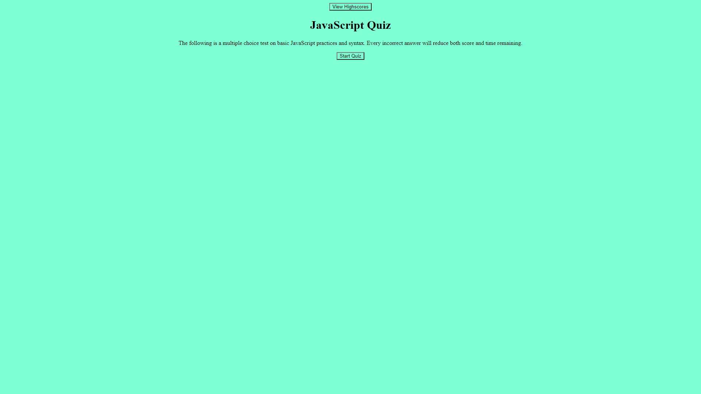

# JavaScript Code Quiz
## Project
The JavaScript Code Quiz was designed to test basic JavaScript knowledge where questions are posed one at a time until either all questions are exhausted or time runs out. Incorrectly answering a question will both dock a point off of score, but will also reduce time remaining by 10 seconds. Upon finishing the test there is a scoreboard that is stored in local storage, allowing the results to be saved slightly more long-term for comparing scores over a longer period of time.

## Challenges and Lessons Learned
As with the the password generator there was an issue with a lack of planning prior to going into the code quiz which lead to multiple restructures and reformats before landing on a set path.
Thanks to Brennen Mazur for helping when I got stuck.

## Known issues
There are a few issues that need to be resolved before this project can be seen as being fully complete. Primarily when in the end screen, when submitting initials, the `submit` button generates a "Play Again!" button. Upon hitting the button multiple times it continues to generate the same button. Secondarily the `True` or `False` question still has four imputs as opposed to having only 2.

## Site
You can find the deployed site at: https://nikolasmazur.github.io/code-quiz/.

After hosting on GitHub Pages the site should look like this:

